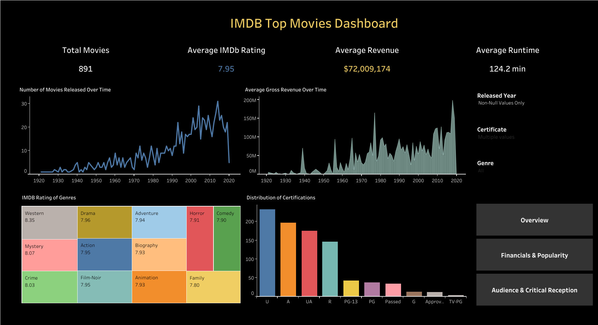

### The Movie Dataset Dashboard - Tableau
A comprehensive and interactive Tableau dashboard for visualizing and analyzing "The Movie Dataset". This project aims to uncover insights into the world of cinema through powerful data visualization.

### 📈 Dashboard
This repository contains the source files for an interactive dashboard built in Tableau. 
The dashboard allows for a deep dive into movie data, exploring trends in genres, revenue, ratings, and more over the years.

#### ➡️ View the Interactive Dashboard on Tableau Public [here](https://public.tableau.com/app/profile/musab.shaikh/viz/Book2_17585355906100/Overview?publish=yes)

### Key Features & Visualizations
- KPI Overview: High-level metrics such as Total Movies, Total Revenue, Average Rating, and Average Runtime.
- Revenue & Budget Analysis: Explore the relationship between a movie's budget and its worldwide gross revenue.
- Top Movies by Genre: Interactively filter the dashboard by genre to see top-performing movies in each category.
- Ratings Distribution: Understand how movie ratings are distributed and identify critically acclaimed films.
- Trends Over Time: Analyze how the number of movies, average revenue, and popularity have changed over the decades.
- Interactive Filters: Dynamically filter the entire dashboard by year, genre, production company, and more to drill down into specific areas of interest.

### 📊 Dataset
This dashboard was created using The Movies Dataset from Kaggle, which is a rich dataset containing information on over 45,000 movies.
[Dataset Source: The Movies Dataset on Kaggle](https://www.kaggle.com/datasets/omarhanyy/imdb-top-1000)

### 🛠️ Tools Used
`Tableau Desktop`: The primary tool used for creating the dashboard and all its visualizations.

### How to Use
View Online: The easiest way to explore the project is to visit the interactive version published on Tableau Public.

### Use the Files:

Download the `.twbx` (Tableau Packaged Workbook) file from this repository.
Open the file using Tableau Desktop or Tableau Reader to interact with the dashboard on your local machine.
Feel free to connect with me if you have any questions or suggestions!

### 🖼️ Preview

